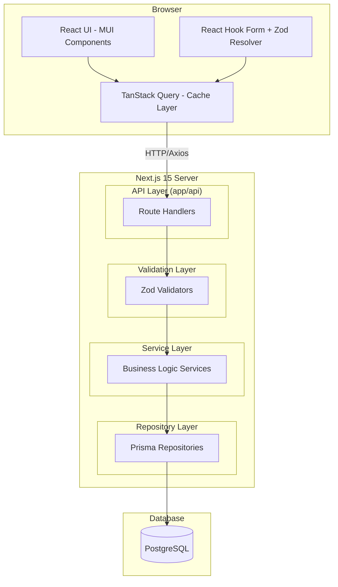
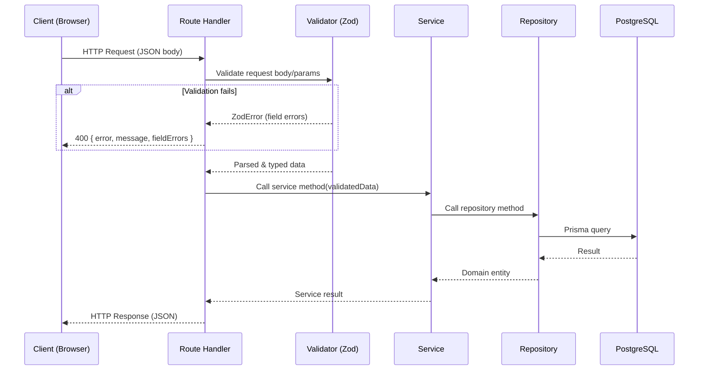
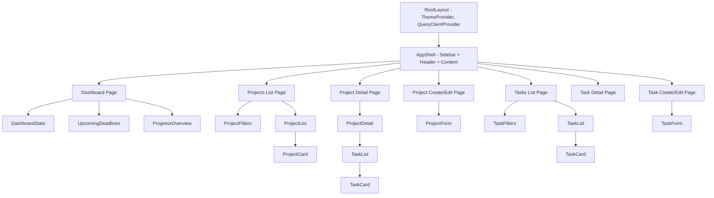
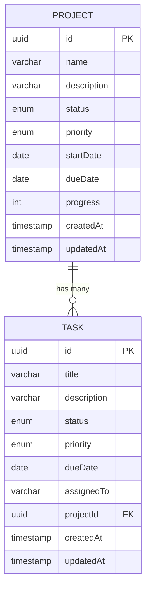
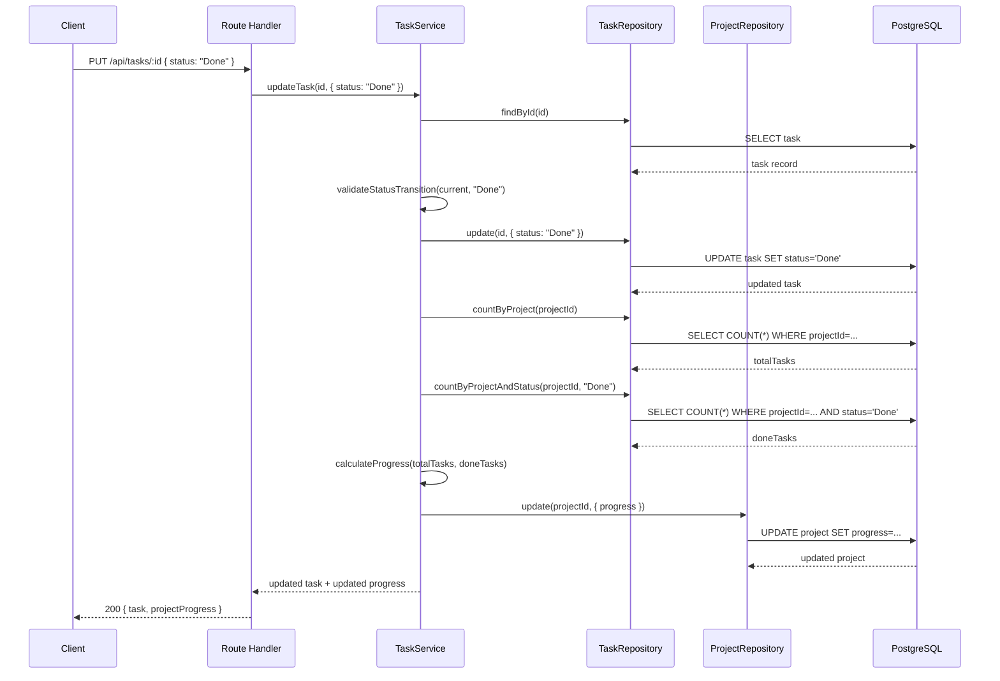

# Design Document: Project Tracker

## Overview

The Project Tracker is a full-stack web application built on Next.js 15 (App Router) that enables teams to create, manage, and monitor projects and their constituent tasks. The system follows a layered architecture with clear separation between API route handlers, service logic, data access (via Prisma ORM), and the React-based frontend.

Key architectural decisions:
- **Monorepo with Next.js App Router**: Single deployment unit for frontend and backend, reducing infrastructure complexity while maintaining logical separation via directory structure.
- **Layered backend**: Route Handlers → Validators → Services → Repositories → Prisma/PostgreSQL, enforcing unidirectional dependency flow.
- **Server-state management via TanStack Query**: Automatic caching, background refetching, and cache invalidation on mutations.
- **Schema-first validation**: Zod schemas serve as the single source of truth for both runtime validation and TypeScript type inference.

## Architecture

### High-Level System Diagram



### Request Flow



### Layer Responsibilities

| Layer | Responsibility | Imports From |
|-------|---------------|--------------|
| Route Handlers (`app/api/`) | HTTP parsing, response formatting, error mapping | Services, Validators, Types |
| Validators (`validators/`) | Zod schema definition, request body/param validation | Types, Zod |
| Services (`services/`) | Business rules, status transitions, progress calculation | Repositories, Validators, Types |
| Repositories (`repositories/`) | Prisma queries, data access | Prisma client, Lib, Utils, Types |
| Lib (`lib/`) | Shared utilities (Prisma client singleton, error classes) | — |

## Components and Interfaces

### Folder Structure

```
project-tracker/
├── app/
│   ├── layout.tsx                  # Root layout with MUI ThemeProvider
│   ├── page.tsx                    # Dashboard page
│   ├── projects/
│   │   ├── page.tsx                # Projects list page
│   │   ├── new/page.tsx            # Create project page
│   │   └── [id]/
│   │       ├── page.tsx            # Project detail page
│   │       └── edit/page.tsx       # Edit project page
│   ├── tasks/
│   │   ├── page.tsx                # Tasks list page
│   │   ├── new/page.tsx            # Create task page
│   │   └── [id]/
│   │       ├── page.tsx            # Task detail page
│   │       └── edit/page.tsx       # Edit task page
│   └── api/
│       ├── dashboard/
│       │   └── route.ts            # GET /api/dashboard
│       ├── projects/
│       │   ├── route.ts            # GET, POST /api/projects
│       │   └── [id]/
│       │       └── route.ts        # GET, PUT, DELETE /api/projects/:id
│       └── tasks/
│           ├── route.ts            # GET, POST /api/tasks
│           └── [id]/
│               └── route.ts        # GET, PUT, DELETE /api/tasks/:id
├── components/
│   ├── layout/
│   │   ├── AppShell.tsx            # Main layout shell (sidebar, header)
│   │   ├── Sidebar.tsx             # Navigation sidebar
│   │   └── Header.tsx              # Top header bar
│   ├── common/
│   │   ├── LoadingSpinner.tsx      # Loading indicator
│   │   ├── ErrorDisplay.tsx        # Error state with retry
│   │   ├── ConfirmDialog.tsx       # Delete confirmation dialog
│   │   ├── StatusBadge.tsx         # Status pill component
│   │   ├── PriorityBadge.tsx       # Priority indicator
│   │   └── ProgressBar.tsx         # Progress bar component
│   └── forms/
│       ├── ProjectForm.tsx         # Shared create/edit project form
│       └── TaskForm.tsx            # Shared create/edit task form
├── features/
│   ├── dashboard/
│   │   ├── DashboardStats.tsx      # Stats cards grid
│   │   ├── UpcomingDeadlines.tsx   # Deadline list component
│   │   └── ProgressOverview.tsx    # Progress summary
│   ├── projects/
│   │   ├── ProjectList.tsx         # Projects table/grid
│   │   ├── ProjectDetail.tsx       # Single project view
│   │   ├── ProjectFilters.tsx      # Search/filter controls
│   │   └── ProjectCard.tsx         # Project summary card
│   └── tasks/
│       ├── TaskList.tsx            # Tasks table/grid
│       ├── TaskDetail.tsx          # Single task view
│       ├── TaskFilters.tsx         # Search/filter controls
│       └── TaskCard.tsx            # Task summary card
├── services/
│   ├── dashboard.service.ts        # Dashboard aggregation logic
│   ├── project.service.ts          # Project business logic
│   └── task.service.ts             # Task business logic
├── repositories/
│   ├── project.repository.ts       # Project data access
│   └── task.repository.ts          # Task data access
├── validators/
│   ├── project.validator.ts        # Project Zod schemas
│   ├── task.validator.ts           # Task Zod schemas
│   └── common.validator.ts         # Shared validators (UUID, pagination)
├── hooks/
│   ├── useProjects.ts              # TanStack Query hooks for projects
│   ├── useTasks.ts                 # TanStack Query hooks for tasks
│   └── useDashboard.ts            # TanStack Query hook for dashboard
├── lib/
│   ├── prisma.ts                   # Prisma client singleton
│   ├── api-client.ts               # Axios instance configuration
│   └── errors.ts                   # Custom error classes
├── types/
│   ├── project.types.ts            # Project TypeScript interfaces
│   ├── task.types.ts               # Task TypeScript interfaces
│   ├── api.types.ts                # API response/request types
│   └── common.types.ts             # Shared types (Priority, Status enums)
├── utils/
│   ├── date.utils.ts               # Date formatting/comparison helpers
│   ├── progress.utils.ts           # Progress calculation helpers
│   └── status-transitions.ts       # Status workflow transition maps
├── prisma/
│   ├── schema.prisma               # Prisma schema definition
│   └── migrations/                 # Migration history
├── tests/
│   ├── unit/
│   │   ├── validators/             # Validator unit tests
│   │   ├── services/               # Service logic tests
│   │   └── utils/                  # Utility function tests
│   ├── property/
│   │   ├── validators.property.ts  # Property-based validator tests
│   │   ├── progress.property.ts    # Property-based progress tests
│   │   └── status.property.ts      # Property-based status tests
│   └── integration/
│       └── api/                    # API route integration tests
├── package.json
├── tsconfig.json
├── next.config.ts
└── .env.local
```

### API Design

#### Dashboard

| Method | Endpoint | Description | Response |
|--------|----------|-------------|----------|
| GET | `/api/dashboard` | Retrieve all dashboard statistics | `DashboardResponse` |

**GET /api/dashboard — Response Schema:**
```typescript
interface DashboardResponse {
  totalProjects: number;        // non-negative integer
  activeProjects: number;       // count where status = "In Progress"
  completedProjects: number;    // count where status = "Completed"
  overdueTasks: number;         // count where dueDate < today && status !== "Done"
  upcomingDeadlines: {
    id: string;
    title: string;
    dueDate: string;            // ISO 8601
    projectId: string;
    projectName: string;
  }[];                          // max 20, ordered by dueDate asc
  averageProgress: number;      // 0.0–100.0, one decimal place
}
```

#### Projects

| Method | Endpoint | Query Params | Description |
|--------|----------|--------------|-------------|
| GET | `/api/projects` | `search`, `status`, `priority`, `sortBy`, `sortOrder` | List/search/filter projects |
| POST | `/api/projects` | — | Create a project |
| GET | `/api/projects/:id` | — | Get project with tasks |
| PUT | `/api/projects/:id` | — | Update a project |
| DELETE | `/api/projects/:id` | — | Delete project and tasks |

**POST /api/projects — Request Schema:**
```typescript
interface CreateProjectRequest {
  name: string;               // 1–100 chars, required, trimmed
  description?: string;       // 0–500 chars, optional
  status?: ProjectStatus;     // defaults to "Planned"
  priority: Priority;         // "Low" | "Medium" | "High", required
  startDate?: string;         // ISO 8601 date, optional
  dueDate?: string;           // ISO 8601 date, optional, must be >= startDate
}
```

**Project Response Schema:**
```typescript
interface ProjectResponse {
  id: string;                 // UUID
  name: string;
  description: string | null;
  status: ProjectStatus;
  priority: Priority;
  startDate: string | null;
  dueDate: string | null;
  progress: number;           // 0–100 integer
  createdAt: string;          // ISO 8601 timestamp
  updatedAt: string;          // ISO 8601 timestamp
  tasks?: TaskResponse[];     // included in GET /:id
}
```

**PUT /api/projects/:id — Request Schema:**
```typescript
interface UpdateProjectRequest {
  name?: string;              // 1–100 chars
  description?: string;       // 0–500 chars
  status?: ProjectStatus;     // validated against transition rules
  priority?: Priority;
  startDate?: string;
  dueDate?: string;           // must be >= startDate (if both provided)
}
```

#### Tasks

| Method | Endpoint | Query Params | Description |
|--------|----------|--------------|-------------|
| GET | `/api/tasks` | `search`, `status`, `priority`, `sortBy`, `sortOrder` | List/search/filter tasks |
| POST | `/api/tasks` | — | Create a task |
| GET | `/api/tasks/:id` | — | Get task details |
| PUT | `/api/tasks/:id` | — | Update a task |
| DELETE | `/api/tasks/:id` | — | Delete a task |

**POST /api/tasks — Request Schema:**
```typescript
interface CreateTaskRequest {
  title: string;              // 1–150 chars, required, trimmed
  description?: string;       // 0–1000 chars, optional
  status?: TaskStatus;        // defaults to "Todo"
  priority: Priority;         // required
  dueDate?: string;           // ISO 8601 date, optional
  assignedTo?: string | null; // 1–100 chars or null
  projectId: string;          // UUID, must reference existing project
}
```

**Task Response Schema:**
```typescript
interface TaskResponse {
  id: string;                 // UUID
  title: string;
  description: string | null;
  status: TaskStatus;
  priority: Priority;
  dueDate: string | null;
  assignedTo: string | null;
  projectId: string;
  createdAt: string;
  updatedAt: string;
}
```

**PUT /api/tasks/:id — Request Schema:**
```typescript
interface UpdateTaskRequest {
  title?: string;             // 1–150 chars
  description?: string;       // 0–1000 chars
  status?: TaskStatus;        // validated against transition rules
  priority?: Priority;
  dueDate?: string;
  assignedTo?: string | null; // set null to unassign
  projectId?: string;         // must reference existing project
}
```

#### Common Query Parameters

```typescript
interface ListQueryParams {
  search?: string;            // 1–200 chars after trim, substring match
  status?: string;            // case-insensitive enum match
  priority?: string;          // case-insensitive: Low | Medium | High
  sortBy?: string;            // "dueDate" (extensible)
  sortOrder?: "asc" | "desc"; // default "asc"
}
```

#### Error Response Schema

```typescript
interface ErrorResponse {
  error: string;              // Error type (e.g., "ValidationError", "NotFoundError")
  message: string;            // Human-readable description
  fieldErrors?: {             // Present for validation errors
    field: string;
    message: string;
  }[];
}
```

### Component Hierarchy



### Key Frontend Interfaces

```typescript
// hooks/useProjects.ts
function useProjects(params?: ListQueryParams): UseQueryResult<ProjectResponse[]>;
function useProject(id: string): UseQueryResult<ProjectResponse>;
function useCreateProject(): UseMutationResult<ProjectResponse, Error, CreateProjectRequest>;
function useUpdateProject(id: string): UseMutationResult<ProjectResponse, Error, UpdateProjectRequest>;
function useDeleteProject(): UseMutationResult<{ id: string }, Error, string>;

// hooks/useTasks.ts
function useTasks(params?: ListQueryParams): UseQueryResult<TaskResponse[]>;
function useTask(id: string): UseQueryResult<TaskResponse>;
function useCreateTask(): UseMutationResult<TaskResponse, Error, CreateTaskRequest>;
function useUpdateTask(id: string): UseMutationResult<TaskResponse, Error, UpdateTaskRequest>;
function useDeleteTask(): UseMutationResult<{ id: string }, Error, string>;

// hooks/useDashboard.ts
function useDashboard(): UseQueryResult<DashboardResponse>;
```

### Service Layer Interfaces

```typescript
// services/project.service.ts
class ProjectService {
  async getDashboardStats(): Promise<DashboardStats>;
  async listProjects(params: ListQueryParams): Promise<Project[]>;
  async getProjectById(id: string): Promise<ProjectWithTasks>;
  async createProject(data: CreateProjectInput): Promise<Project>;
  async updateProject(id: string, data: UpdateProjectInput): Promise<Project>;
  async deleteProject(id: string): Promise<{ id: string }>;
}

// services/task.service.ts
class TaskService {
  async listTasks(params: ListQueryParams): Promise<Task[]>;
  async getTaskById(id: string): Promise<Task>;
  async createTask(data: CreateTaskInput): Promise<Task>;
  async updateTask(id: string, data: UpdateTaskInput): Promise<Task>;
  async deleteTask(id: string): Promise<{ id: string }>;
  async recalculateProjectProgress(projectId: string): Promise<number>;
}
```

### Repository Layer Interfaces

```typescript
// repositories/project.repository.ts
class ProjectRepository {
  async findAll(params: FindAllParams): Promise<Project[]>;
  async findById(id: string): Promise<ProjectWithTasks | null>;
  async create(data: ProjectCreateData): Promise<Project>;
  async update(id: string, data: ProjectUpdateData): Promise<Project>;
  async delete(id: string): Promise<Project>;
  async countByStatus(status: ProjectStatus): Promise<number>;
  async countAll(): Promise<number>;
  async getAverageProgress(): Promise<number>;
}

// repositories/task.repository.ts
class TaskRepository {
  async findAll(params: FindAllParams): Promise<Task[]>;
  async findById(id: string): Promise<Task | null>;
  async create(data: TaskCreateData): Promise<Task>;
  async update(id: string, data: TaskUpdateData): Promise<Task>;
  async delete(id: string): Promise<Task>;
  async countByProjectAndStatus(projectId: string, status: TaskStatus): Promise<number>;
  async countByProject(projectId: string): Promise<number>;
  async findOverdue(today: Date): Promise<number>;
  async findUpcomingDeadlines(today: Date, endDate: Date, limit: number): Promise<TaskWithProject[]>;
}
```

## Data Models

### Prisma Schema

```prisma
generator client {
  provider = "prisma-client-js"
}

datasource db {
  provider = "postgresql"
  url      = env("DATABASE_URL")
}

enum ProjectStatus {
  Planned
  InProgress  @map("In Progress")
  Completed
  OnHold      @map("On Hold")
  Cancelled
}

enum TaskStatus {
  Todo
  InProgress  @map("In Progress")
  Review
  Done
}

enum Priority {
  Low
  Medium
  High
}

model Project {
  id          String        @id @default(uuid()) @db.Uuid
  name        String        @db.VarChar(255)
  description String?       @db.VarChar(2000)
  status      ProjectStatus @default(Planned)
  priority    Priority
  startDate   DateTime?     @db.Date
  dueDate     DateTime?     @db.Date
  progress    Int           @default(0)
  createdAt   DateTime      @default(now())
  updatedAt   DateTime      @updatedAt
  tasks       Task[]

  @@map("projects")
}

model Task {
  id          String     @id @default(uuid()) @db.Uuid
  title       String     @db.VarChar(255)
  description String?    @db.VarChar(2000)
  status      TaskStatus @default(Todo)
  priority    Priority
  dueDate     DateTime?  @db.Date
  assignedTo  String?    @db.VarChar(100)
  projectId   String     @db.Uuid
  project     Project    @relation(fields: [projectId], references: [id], onDelete: Cascade)
  createdAt   DateTime   @default(now())
  updatedAt   DateTime   @updatedAt

  @@index([projectId])
  @@index([status])
  @@index([dueDate])
  @@map("tasks")
}
```

### Entity-Relationship Diagram



### Status Transition Maps

**Project Status Transitions:**
```typescript
const PROJECT_STATUS_TRANSITIONS: Record<ProjectStatus, ProjectStatus[]> = {
  Planned:     ["InProgress", "Cancelled"],
  InProgress:  ["Completed", "OnHold", "Cancelled"],
  Completed:   [],
  OnHold:      ["InProgress", "Cancelled"],
  Cancelled:   [],
};
```

**Task Status Transitions:**
```typescript
const TASK_STATUS_TRANSITIONS: Record<TaskStatus, TaskStatus[]> = {
  Todo:        ["InProgress"],
  InProgress:  ["Review"],
  Review:      ["Done", "InProgress"],
  Done:        [],
};
```

### Progress Calculation Algorithm

```typescript
function calculateProjectProgress(
  totalTasks: number,
  doneTasks: number
): number {
  if (totalTasks === 0) return 0;
  return Math.floor((doneTasks / totalTasks) * 100);
}
```

### Data Flow: Task Status Change with Progress Recalculation



## Correctness Properties

*A property is a characteristic or behavior that should hold true across all valid executions of a system — essentially, a formal statement about what the system should do. Properties serve as the bridge between human-readable specifications and machine-verifiable correctness guarantees.*

### Property 1: Zod Schema Round-Trip Preservation

*For any* valid project or task data object, parsing it through the corresponding Zod schema and then serializing the result SHALL produce a deeply equal object after accounting for schema-defined transforms (whitespace trimming on string fields).

**Validates: Requirements 19.5, 19.3**

### Property 2: Validator Rejects Invalid String Inputs

*For any* string input that violates field constraints (project name: empty-after-trim or >100 chars; task title: empty-after-trim or >150 chars; project description: >500 chars; task description: >1000 chars; assignedTo: >100 chars; search: >200 chars), the corresponding Zod validator SHALL reject the input and the parsed result SHALL be an error.

**Validates: Requirements 2.4, 2.5, 2.9, 7.4, 7.5, 7.11, 12.4, 13.5, 14.5**

### Property 3: Date Constraint Enforcement

*For any* pair of dates where dueDate is strictly earlier than startDate, the project validator SHALL reject the input. *For any* pair where dueDate >= startDate, the validator SHALL accept the date fields (assuming all other fields are valid).

**Validates: Requirements 2.7**

### Property 4: Unknown Fields Rejection

*For any* request body object containing one or more fields not defined in the endpoint's Zod schema, the validator SHALL reject the entire input and return an error identifying the unrecognized fields.

**Validates: Requirements 19.4**

### Property 5: Project Status Transition Enforcement

*For any* project with a current status and *for any* attempted new status value, the system SHALL accept the transition if and only if (currentStatus, newStatus) is in the allowed transitions map: {Planned→InProgress, Planned→Cancelled, InProgress→Completed, InProgress→OnHold, InProgress→Cancelled, OnHold→InProgress, OnHold→Cancelled}. All other transitions SHALL be rejected.

**Validates: Requirements 6.1, 6.2, 6.3**

### Property 6: Task Status Transition Enforcement

*For any* task with a current status and *for any* attempted new status value, the system SHALL accept the transition if and only if (currentStatus, newStatus) is in the allowed transitions map: {Todo→InProgress, InProgress→Review, Review→Done, Review→InProgress}. All other transitions SHALL be rejected.

**Validates: Requirements 11.1, 11.2, 11.4, 11.5**

### Property 7: Progress Calculation Correctness

*For any* non-negative integer `totalTasks` and non-negative integer `doneTasks` where `doneTasks <= totalTasks`, the progress calculation SHALL return `floor(doneTasks / totalTasks * 100)` when `totalTasks > 0`, and SHALL return `0` when `totalTasks == 0`. Additionally, when a project transitions to status "Completed", progress SHALL be set to 100 regardless of task counts.

**Validates: Requirements 18.1, 18.2, 9.5, 10.2, 6.4**

### Property 8: Search Filter Correctness

*For any* collection of projects (or tasks) and *for any* non-empty, non-whitespace search string of at most 200 characters, all returned results SHALL contain the search term as a case-insensitive substring in the name/title or description field. Conversely, *for any* whitespace-only or empty search string, the system SHALL return the unfiltered collection.

**Validates: Requirements 13.1, 13.4, 14.1, 14.4**

### Property 9: Status Filter Correctness

*For any* collection of projects (or tasks) and *for any* valid status filter value, all returned results SHALL have a status field matching the filter value (case-insensitive). *For any* invalid status value (not in the allowed enum), the system SHALL reject with a 400 error.

**Validates: Requirements 15.1, 15.2, 15.3**

### Property 10: Priority Filter Correctness

*For any* collection of projects (or tasks) and *for any* valid priority filter value (Low, Medium, or High), all returned results SHALL have a priority field matching the filter value (case-insensitive). *For any* invalid priority value, the system SHALL reject with a 400 error.

**Validates: Requirements 16.1, 16.2, 16.3, 16.6**

### Property 11: Sort Ordering Correctness

*For any* collection of entities with dueDate fields, when sorted by dueDate ascending, each entity's dueDate SHALL be less than or equal to the next entity's dueDate, with null dueDates appearing last. When sorted descending, each entity's dueDate SHALL be greater than or equal to the next, with null dueDates appearing first.

**Validates: Requirements 17.1, 17.2, 17.5**

### Property 12: Failed Validation Preserves Data Integrity

*For any* existing project or task record and *for any* update request that fails validation, the record in the database SHALL remain unchanged after the rejected request completes.

**Validates: Requirements 4.6**

### Property 13: Overdue Task Identification

*For any* task with a dueDate and a status, the task SHALL be classified as overdue if and only if `dueDate < today` AND `status !== "Done"`. Tasks with status "Done" or with dueDate >= today SHALL never be classified as overdue.

**Validates: Requirements 1.4**

## Error Handling

### Error Classification

| Error Type | HTTP Status | Trigger |
|-----------|-------------|---------|
| `ValidationError` | 400 | Zod schema validation failure, malformed ID, invalid params |
| `NotFoundError` | 404 | Resource lookup by ID returns null |
| `ConflictError` | 409 | Database constraint violation (unique, FK) |
| `TransitionError` | 400 | Invalid status transition attempt |
| `InternalError` | 500 | Unhandled exceptions |

### Error Response Format

All error responses use a consistent JSON envelope:

```typescript
// lib/errors.ts
abstract class AppError extends Error {
  abstract statusCode: number;
  abstract errorType: string;
}

class ValidationError extends AppError {
  statusCode = 400;
  errorType = "ValidationError";
  fieldErrors: { field: string; message: string }[];
}

class NotFoundError extends AppError {
  statusCode = 404;
  errorType = "NotFoundError";
}

class ConflictError extends AppError {
  statusCode = 409;
  errorType = "ConflictError";
}

class TransitionError extends AppError {
  statusCode = 400;
  errorType = "TransitionError";
  currentStatus: string;
  attemptedStatus: string;
  allowedTransitions: string[];
}
```

### Error Handling Strategy

```typescript
// lib/api-handler.ts — Wrapper for all route handlers
function withErrorHandling(
  handler: (req: NextRequest, ctx: RouteContext) => Promise<NextResponse>
) {
  return async (req: NextRequest, ctx: RouteContext) => {
    try {
      return await handler(req, ctx);
    } catch (error) {
      if (error instanceof AppError) {
        return NextResponse.json(
          {
            error: error.errorType,
            message: error.message,
            ...(error instanceof ValidationError && { fieldErrors: error.fieldErrors }),
          },
          { status: error.statusCode }
        );
      }
      // Prisma-specific error mapping
      if (error instanceof Prisma.PrismaClientKnownRequestError) {
        if (error.code === "P2002") {
          return NextResponse.json(
            { error: "ConflictError", message: "Resource already exists" },
            { status: 409 }
          );
        }
        if (error.code === "P2025") {
          return NextResponse.json(
            { error: "NotFoundError", message: "Resource not found" },
            { status: 404 }
          );
        }
      }
      // Generic 500 — never expose internals
      console.error("Unhandled error:", error);
      return NextResponse.json(
        { error: "InternalError", message: "An unexpected error occurred" },
        { status: 500 }
      );
    }
  };
}
```

### Frontend Error Handling

- **TanStack Query** retries failed requests 3 times with exponential backoff before surfacing errors.
- **Error boundaries** catch rendering errors and display a fallback UI.
- **Form submission errors** are caught by mutation `onError` callbacks and displayed inline without losing form state.
- **Loading states** appear within 200ms via React Suspense boundaries or conditional rendering.

## Testing Strategy

### Testing Framework

- **Unit & Integration Tests**: Vitest (fast, TypeScript-native, compatible with Next.js)
- **Property-Based Tests**: fast-check (JavaScript/TypeScript PBT library)
- **Component Tests**: React Testing Library + Vitest
- **E2E Tests** (future): Playwright

### Test Structure

```
tests/
├── unit/
│   ├── validators/
│   │   ├── project.validator.test.ts
│   │   └── task.validator.test.ts
│   ├── services/
│   │   ├── project.service.test.ts
│   │   └── task.service.test.ts
│   └── utils/
│       ├── progress.utils.test.ts
│       ├── status-transitions.test.ts
│       └── date.utils.test.ts
├── property/
│   ├── validators.property.test.ts     # Properties 1, 2, 3, 4
│   ├── progress.property.test.ts       # Property 7
│   ├── status.property.test.ts         # Properties 5, 6
│   ├── search.property.test.ts         # Property 8
│   ├── filter.property.test.ts         # Properties 9, 10
│   ├── sort.property.test.ts           # Property 11
│   └── overdue.property.test.ts        # Property 13
├── integration/
│   └── api/
│       ├── dashboard.test.ts
│       ├── projects.test.ts
│       └── tasks.test.ts
└── components/
    ├── ProjectForm.test.tsx
    ├── TaskForm.test.tsx
    └── Dashboard.test.tsx
```

### Dual Testing Approach

**Unit Tests** focus on:
- Specific examples demonstrating correct behavior (happy paths)
- Integration points between layers (service calls repository correctly)
- Edge cases (empty strings, boundary values, null handling)
- Error conditions (invalid inputs, not found scenarios)

**Property-Based Tests** focus on:
- Universal properties that hold for ALL valid inputs
- Comprehensive input coverage through randomization (100+ iterations minimum)
- Discovering edge cases humans wouldn't think to test
- Formal verification of business rules

### Property-Based Testing Configuration

- **Library**: fast-check
- **Minimum iterations**: 100 per property test
- **Tagging format**: Each test annotated with `// Feature: project-tracker, Property {N}: {title}`
- **Example property test structure**:

```typescript
import fc from "fast-check";
import { describe, it, expect } from "vitest";
import { createProjectSchema } from "@/validators/project.validator";

describe("Property Tests: Zod Schema Round-Trip", () => {
  // Feature: project-tracker, Property 1: Zod Schema Round-Trip Preservation
  it("should produce deeply equal objects after parse for any valid input", () => {
    const validProjectArb = fc.record({
      name: fc.string({ minLength: 1, maxLength: 100 }).map(s => s.trim()).filter(s => s.length > 0),
      description: fc.option(fc.string({ maxLength: 500 })),
      priority: fc.constantFrom("Low", "Medium", "High"),
      startDate: fc.option(fc.date().map(d => d.toISOString())),
    });

    fc.assert(
      fc.property(validProjectArb, (input) => {
        const result = createProjectSchema.safeParse(input);
        if (result.success) {
          const reparsed = createProjectSchema.safeParse(result.data);
          expect(reparsed.success).toBe(true);
          if (reparsed.success) {
            expect(reparsed.data).toEqual(result.data);
          }
        }
      }),
      { numRuns: 100 }
    );
  });
});
```

### Integration Testing Approach

- Use a test database (PostgreSQL via Docker or in-memory alternative)
- Seed data before each test suite
- Clean up after each test case
- Test full request → response cycles through route handlers
- Verify HTTP status codes, response bodies, and side effects

### Coverage Goals

| Layer | Target Coverage | Focus |
|-------|----------------|-------|
| Validators | 95%+ | Property tests cover input space comprehensively |
| Services | 90%+ | Business logic, status transitions, progress calculation |
| Repositories | 80%+ | Integration tests with test database |
| Route Handlers | 85%+ | Integration tests for endpoint behavior |
| Components | 70%+ | Key interactions, form validation, error states |
